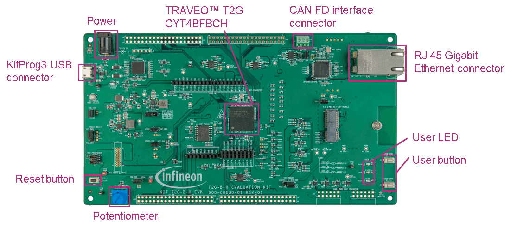
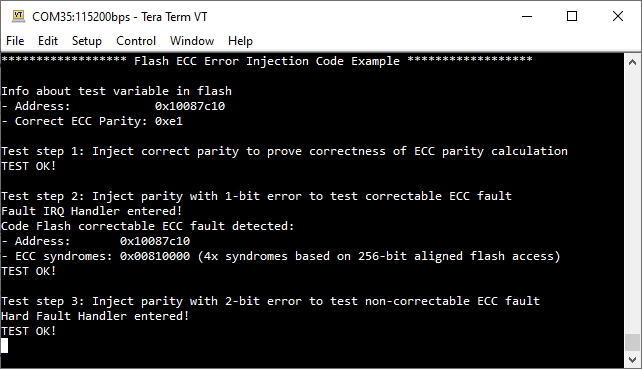

# Flash ECC Error Injection
**This code example demonstrates the usage of the ECC error injection feature to test the functionality of Flash Error Correcting Code (ECC).**

## Device
The device used in this code example (CE) is:
- [TRAVEO™ T2G CYT4BF Series](https://www.infineon.com/cms/en/product/microcontroller/32-bit-traveo-t2g-arm-cortex-microcontroller/32-bit-traveo-t2g-arm-cortex-for-body/traveo-t2g-cyt4bf-series/)

## Board
The board used for testing is:
- TRAVEO™ T2G evaluation kit ([KIT_T2G-B-H_EVK](https://www.infineon.com/cms/en/product/evaluation-boards/kit_t2g-b-h_evk/), [KIT_T2G-B-H_LITE](https://www.infineon.com/cms/en/product/evaluation-boards/kit_t2g-b-h_lite/))

## Scope of work

In this example, the ECC error injection mechanism is used to inject an error into the target Code Flash address. When the target address is read, the flash controller's ECC logic triggers a fault through the central fault sub-system, indicating the error. In case of non-correctable errors, a bus error is returned to the requester in addition. The faults are then handled, and the fault information is displayed.

This example demonstrates Single Error Correction and Double Error Detection (SECDED).

## Introduction  

**Flash Controller**

Code Flash is a flash memory used to store programs. The flash controller supports ECC logic for the functional safety of the flash memory.

When data is programmed into the flash memory, the ECC is calculated and stored along with the data. For 64-bit data, an 8-bit ECC parity value is used. Similarly, when data is read from the flash memory, the ECC logic calculates the parity value for the data. If there is a mismatch, it triggers a fault, indicating data corruption. 

The ECC logic supports Single Error Correction and Double Error Detection (SECDED).

**ECC correctable errors:** When the ECC logic detects a single-bit error, the error is corrected in the data returned on the bus and a fault is reported to the fault structure. 

**ECC non-correctable errors:** If the ECC logic detects an error with more than one bit wrong, the data cannot be corrected with the available ECC parity information. So, the ECC logic returns a bus error response to the requester. Additionally, a fault is reported to the fault structure.

**Fault Reporting**

Both ECC correctable errors and ECC non-correctable errors are reported to the central fault structure. 

The fault structure can be configured to catch the fault and trigger an interrupt. On trigger, the CPU enters the interrupt handler, through which the fault information can be retrieved and further action can be taken by the application. For non-correctable errors the code flash also responds with a bus error to the requester. If the CPU is the requester a *HardFault* exception is raised and the *HardFault* handler is entered which has a higher priority than a fault structure interrupt. The application can then retrieve fault information from the related CPU fault registers and may check the fault structure in addition before deciding on how to handle the fault.

**ECC Error Injection**

ECC error injection is a mechanism to test whether the ECC logic is working as expected and also to verify the fault reporting path. 

An error can be deliberately injected into the flash by writing the *FLASHC_ECC_CTL* register with the target address and the desired ECC parity value.
When ECC error injection is enabled, the ECC logic uses this parity value instead of the parity value stored in the flash for the data read at the target address. Thus, an error in the injected parity triggers a fault. 

More details can be found in [Technical Reference Manual (TRM)](https://www.infineon.com/dgdl/?fileId=5546d4627600a6bc017600bfae720007), [Registers TRM](https://www.infineon.com/dgdl/?fileId=5546d4627600a6bc017600be2aef0004) and [Data Sheet](https://www.infineon.com/dgdl/?fileId=5546d46275b79adb0175dc8387f93228).

## Hardware setup

This CE has been developed for:
- TRAVEO™ T2G evaluation kit ([KIT_T2G-B-H_EVK](https://www.infineon.com/cms/en/product/evaluation-boards/kit_t2g-b-h_evk/)) 
 
No changes are required from the board's default settings.

- TRAVEO™ T2G evaluation kit lite ([KIT_T2G-B-H_LITE](https://www.infineon.com/cms/en/product/evaluation-boards/kit_t2g-b-h_lite/)) 
   
No changes are required from the board's default settings.

A UART serial connection should be made with the computer via the serial port (KitProg3 connector). Use a terminal emulator to see the output on the screen. In the terminal emulator settings, select the KitProg3 COM port and set the baud rate to 115200. 

## Implementation

This example performs three test steps to test the functionality of the ECC logic using the ECC error injection mechanism.

A 64-bit constant *FLASH_TEST_VAR* is declared and assigned a value at compile-time. This constant data will be stored in the Code Flash.
The main function calculates the ECC parity value for the data and verifies its correctness by injecting it into the target address. Then the parity values with 1-bit and 2-bit errors are injected into the target address to observe the behavior of the ECC logic.
The fault caused and the fault source information is displayed on the terminal program.

**STDOUT/STDIN setting**

Initialization of the GPIO for UART is done in the <a href="https://infineon.github.io/retarget-io/html/group__group__board__libs.html#gaddff65f18135a8491811ee3886e69707"><i>cy_retarget_io_init()</i></a> function.
- Initializes the pin specified by *CYBSP_DEBUG_UART_TX* as UART TX and the pin specified by *CYBSP_DEBUG_UART_RX* as UART RX (these pins are connected to KitProg3 COM port)
- The serial port parameters are 8N1 and 115200 baud

**Fault handling initialization**

API calls to initialize fault handling are done in *initFaultHandling()* function.
First, the fault status is cleared using <a href="https://infineon.github.io/mtb-pdl-cat1/pdl_api_reference_manual/html/group__group__sysfault__functions.html#ga0a2a097b9b1d69fb51806964639c7af7"><i>Cy_SysFault_ClearStatus()</i></a>. Then the fault structure 0 is configured to trigger an interrupt when it captures a Code Flash ECC correctable fault using <a href="https://infineon.github.io/mtb-pdl-cat1/pdl_api_reference_manual/html/group__group__sysfault__functions.html#gafb1516898b15bdc985a7460c7a9f7ca1"><i>Cy_SysFault_SetMaskByIdx()</i></a>, <a href="https://infineon.github.io/mtb-pdl-cat1/pdl_api_reference_manual/html/group__group__sysfault__functions.html#ga2b7d86c125f4c1d55ffabfecc3b31338"><i>Cy_SysFault_SetInterruptMask()</i></a> and finally <a href="https://infineon.github.io/mtb-pdl-cat1/pdl_api_reference_manual/html/group__group__sysfault__functions.html#ga883297a5695f829251d11fb1cc6b6b4c"><i>Cy_SysFault_Init()</i></a>.  
As a last step *handleFaultIrq()* is setup as an interrupt handler and the system and CPU interrupt are enabled by calling <a href="https://infineon.github.io/mtb-pdl-cat1/pdl_api_reference_manual/html/group__group__sysint__functions.html#gab2ff6820a898e9af3f780000054eea5d"><i>Cy_SysInt_Init()</i></a> and *NVIC_EnableIRQ()*.

**Parity calculation**

The parity value for the 64-bit test data *FLASH_TEST_VAR* is calculated in the *getParityForValue()* function using the algorithm mentioned in the [Technical Reference Manual (TRM)](https://www.infineon.com/dgdl/?fileId=5546d4627600a6bc017600bfae720007) section *Software Generating Code Flash ECC*. 

**ECC error injection**

There are three steps performed to test the ECC behavior by injecting no error, 1-bit error and 2-bit error respectively. In each test case, the function *injectParity()* is called to enable the injection of the provided parity value for the specified address. This is done by writing the parity value and the target address to the corresponding fields of the *FLASHC_ECC_CTL* register. Then the ECC error injection feature is enabled using *FLASHC_FLASH_CTL* register. 

**Test step 1:** Inject correct parity to prove the correctness of the ECC parity calculation

In this test step, the correct parity is injected into the target address using *injectParity()*. Then a test read is performed on the target flash address using the function *executeTestAccess()*.  

The test step is passed if no fault occurred and the data read is correct.

**Test step 2:** Inject parity with 1-bit error to test correctable ECC fault

A single-bit error is induced into the correct parity value by flipping one bit. This value is injected into the target address and ECC error injection is enabled using the function *injectParity()*. Then the target address is read by calling *executeTestAccess()*. This read action results in a fault struct interrupt and the CPU enters the fault IRQ handler *handleFaultIrq()*. In this handler, the fault source is verified and fault-specific data is displayed on the terminal program.  

The test step is passed if the injected ECC error has caused a fault interrupt, but the data read is correct.

**Test step 3:** Inject parity with 2-bit error to test non-correctable ECC fault

A two-bit error is induced into the correct parity by flipping two bits. This value is injected into the target address and ECC error injection is enabled using the function *injectParity()*. Then the target address is read by calling *executeTestAccess()*. This read action results in a *HardFault* and the CPU enters the *HardFault* handler. The execution flow eventually reaches *Cy_SysLib_ProcessingFault()*. This function overrides the *weak* implementation provided by the PDL and is used to evaluate the fault information that is available in the global variable *cy_faultFrame*. Once the application enters this handler, it remains in an infinite loop.

The test is passed if the 2-bit ECC error injection has caused a *HardFault*. 

## Run and Test
For this example, a terminal emulator is required for displaying outputs. Install a terminal emulator if you do not have one. Instructions in this document use [Tera Term](https://ttssh2.osdn.jp/index.html.en).

After code compilation, perform the following steps for flashing the device:
1. Connect the board to your PC using the provided USB cable through the KitProg3 USB connector.
2. Open a terminal program and select the KitProg3 COM port. Set the serial port parameters to 8N1 and 115200 baud.
3. Program the board using one of the following:
    - Select the code example project in the Project Explorer.
    - In the **Quick Panel**, scroll down, and click **[Project Name] Program (KitProg3_MiniProg4)**.
4. After programming, the code example starts automatically. Confirm that the messages are displayed on the UART terminal:

   *Figure 1. Terminal output on program startup* 

5. You can debug the example to step through the code. In the IDE, use the **[Project Name] Debug (KitProg3_MiniProg4)** configuration in the **Quick Panel**. For details, see the "Program and debug" section in the [Eclipse IDE for ModusToolbox™ software user guide](https://www.cypress.com/MTBEclipseIDEUserGuide).

**Note:** **(Only while debugging)** On the CM7 CPU, some code in *main()* may execute before the debugger halts at the beginning of *main()*. This means that some code executes twice: once before the debugger stops execution, and again after the debugger resets the program counter to the beginning of *main()*. See [KBA231071](https://community.cypress.com/docs/DOC-21143) to learn about this and for the workaround.

**Expected behavior**

The terminal program displays the address and the correct ECC parity value of the test variable. Three test steps are performed and the terminal program displays the test description, fault information and test results.

Test step 1 is passed if the injected correct parity has caused no fault and the data read is correct.

Test step 2 is passed if the injected 1-bit ECC error has caused a fault interrupt, but the data read is correct.

Test step 3 is passed if the injected 2-bit ECC error has caused a *HardFault*.

## References            

Relevant Application notes are:
- AN235305 - GETTING STARTED WITH TRAVEO™ T2G FAMILY MCUS IN MODUSTOOLBOX™
- [AN220242](https://www.infineon.com/dgdl/?fileId=8ac78c8c7cdc391c017d0d3b05c26796) - Flash accessing procedure for TRAVEO™ T2G family
- [AN219842](https://www.infineon.com/dgdl/?fileId=8ac78c8c7cdc391c017d0d3a490a6732) - How to use interrupt in TRAVEO™ II

ModusToolbox™ is available online:
- <https://www.infineon.com/modustoolbox>

Associated TRAVEO™ T2G MCUs can be found on:
- <https://www.infineon.com/cms/en/product/microcontroller/32-bit-traveo-t2g-arm-cortex-microcontroller/>

More code examples can be found on the GIT repository:
- [TRAVEO™ T2G Code examples](https://github.com/orgs/Infineon/repositories?q=mtb-t2g-&type=all&language=&sort=)

For additional training, visit our webpage:  
- [TRAVEO™ T2G training](https://www.infineon.com/cms/en/product/microcontroller/32-bit-traveo-t2g-arm-cortex-microcontroller/32-bit-traveo-t2g-arm-cortex-for-body/traveo-t2g-cyt4bf-series/#!trainings)

For questions and support, use the TRAVEO™ T2G Forum:  
- <https://community.infineon.com/t5/TRAVEO-T2G/bd-p/TraveoII>  
